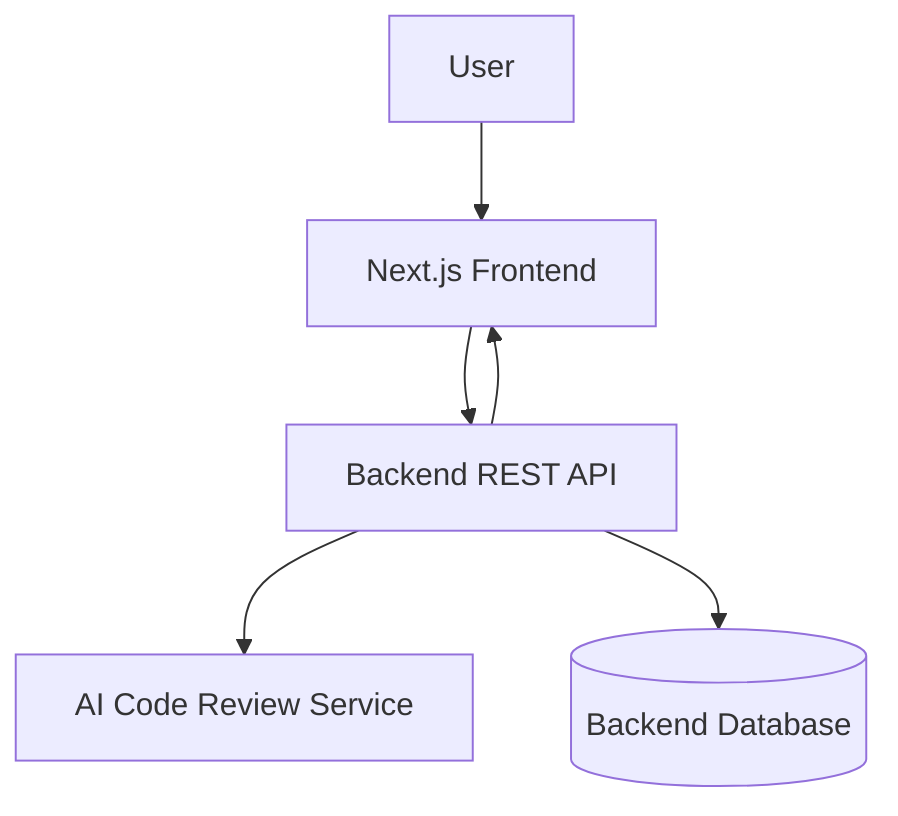
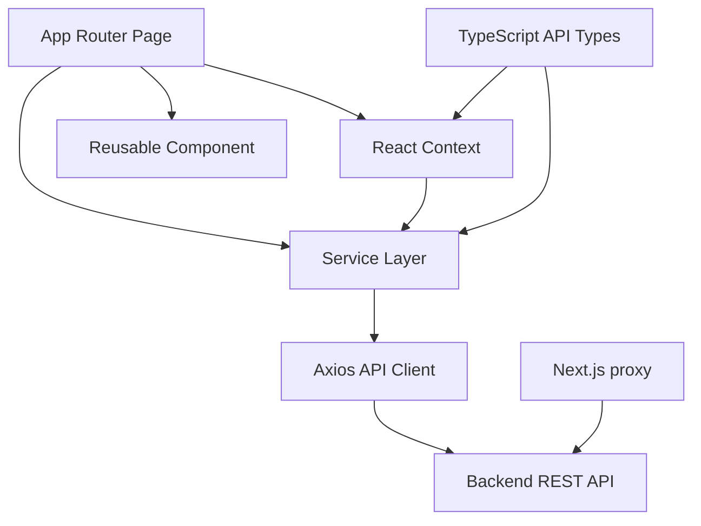
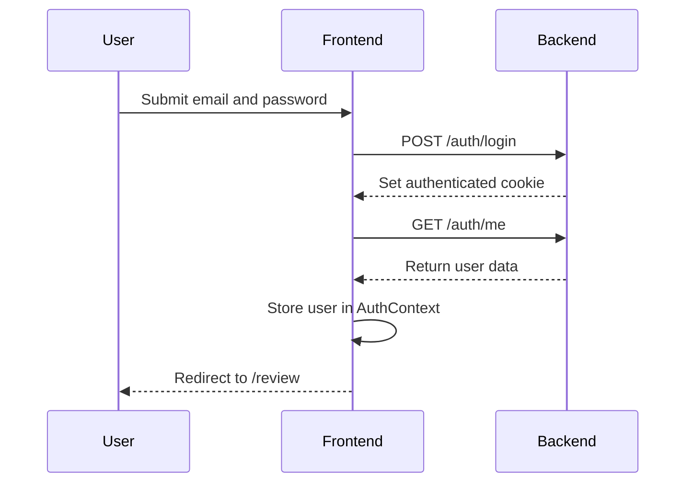
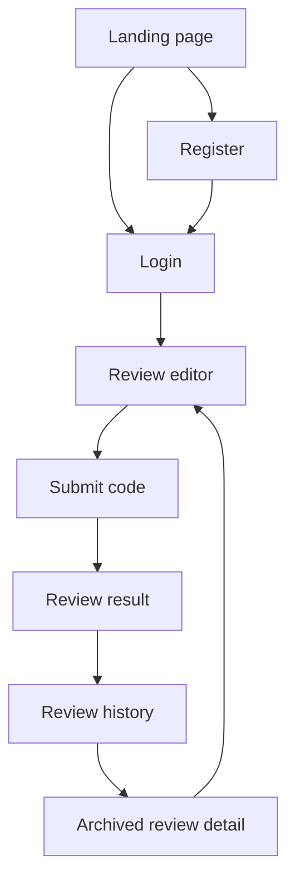

# AI Code Review Frontend

AI Code Review is a Next.js frontend for submitting source-code snippets to a backend review service and presenting structured automated feedback. It is intended for developers who want an accessible workflow for checking code quality, security risks, architectural concerns, and maintainability before deployment.

The frontend provides the public product presentation, authentication screens, an authenticated code-review workspace, and archived review pages. The AI analysis itself is performed by the backend system rather than in the browser.

**Live deployment:** [https://ai-review-code-fe.vercel.app/](https://ai-review-code-fe.vercel.app/)

**Contact:** [youssibarani17@gmail.com](mailto:youssibarani17@gmail.com)

## Table of Contents

- [Overview](#overview)
- [Features](#features)
- [Tech Stack](#tech-stack)
- [Architecture](#architecture)
- [Project Structure](#project-structure)
- [Application Routes](#application-routes)
- [Page Documentation](#page-documentation)
- [Component Architecture](#component-architecture)
- [State Management](#state-management)
- [API Integration](#api-integration)
- [Backend API Integration](#backend-api-integration)
- [Authentication Flow](#authentication-flow)
- [Protected Routes](#protected-routes)
- [Forms and Validation](#forms-and-validation)
- [AI Code Review User Flow](#ai-code-review-user-flow)
- [UI States](#ui-states)
- [Responsive Design](#responsive-design)
- [Environment Variables](#environment-variables)
- [Installation](#installation)
- [Running the Application](#running-the-application)
- [API Configuration](#api-configuration)
- [Usage Guide](#usage-guide)
- [Example User Flow](#example-user-flow)
- [Error Handling](#error-handling)
- [Performance Considerations](#performance-considerations)
- [Accessibility](#accessibility)
- [Testing](#testing)
- [Deployment](#deployment)
- [Production Configuration](#production-configuration)
- [Troubleshooting](#troubleshooting)
- [Future Improvements](#future-improvements)
- [Documentation Audit](#documentation-audit)

## Overview

The frontend is the user-facing layer of an AI-assisted code inspection system:



Users register or sign in, submit code with a selected language, and receive a review containing a score, executive summary, severity-classified findings, and optional suggestions. The frontend also retrieves the user's previous reviews from the backend and displays each review at a dynamic detail route.

The landing-page preview is intentionally static mock content. It demonstrates the product experience without making an API request.

## Features

- Public CodeAudit.ai landing page with feature, preview, roadmap, and authentication call-to-action sections.
- Email and password registration.
- Email and password login.
- Google authentication redirect through the backend OAuth endpoint.
- Authenticated code-review workspace.
- Support for TypeScript, JavaScript, Python, Java, and Go submissions.
- Review score and status presentation.
- Findings grouped by `LOW`, `MEDIUM`, `HIGH`, and `CRITICAL` severity.
- Optional suggested patches with clipboard copy actions.
- Review history in a responsive sidebar.
- Archived review detail pages.
- Responsive layouts for authentication and review screens.
- Sidebar controls for starting a new review, opening history, and signing out.

## Tech Stack

| Technology                          | Purpose                                                          |
| ----------------------------------- | ---------------------------------------------------------------- |
| Next.js 16.3.3                      | React framework and App Router routing                           |
| React 19.2.8                        | Client-side UI and stateful interactions                         |
| TypeScript                          | Static typing for components, services, contexts, and API models |
| Axios 1.20.0                        | Shared REST API client                                           |
| Tailwind CSS 4                      | Utility-first styling and responsive layouts                     |
| `lucide-react`                      | Interface icons                                                  |
| React Context API                   | Authentication and review state providers                        |
| Native `fetch`                      | Direct registration request and route authentication check       |
| ESLint 9 with Next.js configuration | Linting                                                          |
| React Compiler                      | Enabled through Next.js configuration                            |

## Architecture

The application uses the Next.js App Router and separates UI, state, API services, and shared types:



- **Routes and pages** render the landing, authentication, review editor, and review detail experiences.
- **Contexts** hold cross-page authentication and review state.
- **Hooks** expose context values and enforce provider usage.
- **Services** define authentication and review operations.
- **The Axios client** centralizes the API base URL, timeout, and credential behavior.
- **The proxy** checks access to `/review` routes by forwarding the incoming cookie to `/auth/me`.
- **Types** describe request payloads and expected authentication and review responses.
- **Tailwind CSS** provides the visual system, responsive breakpoints, spacing, and state styling.

## Project Structure

```text
.
├── documentation/
│   └── README.md
├── public/
├── src/
│   ├── app/
│   │   ├── auth/
│   │   │   ├── login/page.tsx
│   │   │   └── register/page.tsx
│   │   ├── review/
│   │   │   ├── page.tsx
│   │   │   └── [id]/page.tsx
│   │   ├── globals.css
│   │   ├── layout.tsx
│   │   └── page.tsx
│   ├── component/
│   │   └── ReviewSideBar.tsx
│   ├── context/
│   │   ├── auth.context.tsx
│   │   └── review.context.tsx
│   ├── hooks/
│   │   ├── useAuth.ts
│   │   └── useReview.ts
│   ├── lib/
│   │   └── axios.ts
│   ├── services/
│   │   ├── auth.service.ts
│   │   └── review.service.ts
│   ├── type/
│   │   ├── auth.type.ts
│   │   └── review.type.ts
│   └── proxy.ts
├── eslint.config.mjs
├── next.config.ts
├── package.json
├── postcss.config.mjs
└── tsconfig.json
```

The repository does not contain a `pages/` directory, `utils/` directory, database code, custom Next.js API routes, or a separate store library. Public assets currently contain the default starter SVG files and are not used by the main application screens.

## Application Routes

| Route            | Access        | Description                                       |
| ---------------- | ------------- | ------------------------------------------------- |
| `/`              | Public        | Product landing page and static interface preview |
| `/auth/login`    | Public        | Email/password and Google sign-in screen          |
| `/auth/register` | Public        | Account registration screen                       |
| `/review`        | Authenticated | Code editor and current review result             |
| `/review/[id]`   | Authenticated | Archived review detail for a specific review ID   |

The `/review/:path*` matcher in `src/proxy.ts` applies the authentication check to both the editor and dynamic review-detail routes.

## Page Documentation

### Landing Page

**Route:** `/`

The landing page introduces CodeAudit.ai and links users to registration or login. It contains a static interactive preview that switches between sample code and sample audit results. The preview uses local sample data and does not call the backend.

### Login Page

**Route:** `/auth/login`

The login form accepts an email address and password. On submission it calls `POST /auth/login`, then calls `GET /auth/me` to retrieve the authenticated user, stores that user in `AuthContext`, and redirects to `/review`. The page also provides a Google sign-in action that navigates to the backend's `/auth/google` endpoint.

The page displays request errors and disables the email/password submit button while the request is running.

### Registration Page

**Route:** `/auth/register`

The registration form accepts `name`, `email`, and `password`. It sends a JSON `POST` request to `/auth/register` using the configured API URL. A successful registration redirects the user to `/auth/login`; a failed request displays the backend error message when available.

### Review Workspace

**Route:** `/review`

This authenticated page provides the main code-review workflow. Users select one of five supported languages, enter code into a textarea, and submit it through `POST /review`. After a successful response, the page displays the review score, status, summary, findings, severity badges, line references, and available suggestions. The review history is refreshed after submission.

Users can submit through the form button or `Ctrl+Enter`. Suggested patches can be copied to the clipboard.

### Archived Review Detail

**Route:** `/review/[id]`

This authenticated page loads a single review with `GET /review/:id`. It displays the submitted code, language, creation date, score, status, summary, findings, and optional suggestions. The original submitted code can also be copied. The sidebar provides navigation back to the editor and other archived reviews.

## Component Architecture

| Component           | Responsibility                                                                                            |
| ------------------- | --------------------------------------------------------------------------------------------------------- |
| `AuthProvider`      | Hydrates the current user with `/auth/me`, stores the user, and handles logout state and redirect.        |
| `ReviewProvider`    | Stores the current review, history list, selected historical review, and review-fetching actions.         |
| `ReviewSideBar`     | Shows review history, score badges, new-review navigation, mobile overlay behavior, and sign-out control. |
| `LoginPage`         | Renders email/password login, Google login, loading state, and authentication errors.                     |
| `RegisterPage`      | Renders account registration, loading state, and registration errors.                                     |
| `ReviewPage`        | Renders the editable code workspace and the current review result.                                        |
| `ReviewHistoryPage` | Renders an archived review and its submitted source code.                                                 |

`useAuth` and `useReview` are small access hooks. Each throws an error if it is used outside its corresponding provider.

## State Management

The application uses React `useState`, `useEffect`, and `useMemo` together with the React Context API. It does not use Redux, Zustand, React Query, SWR, or browser local storage for application state.

- `AuthContext` stores the current `User | null`, exposes login state updates, hydrates the user on mount, and clears the user during logout.
- `ReviewContext` stores the current submitted review, the review-history list, and the selected historical review.
- Local page state stores form fields, selected language, loading flags, error messages, sidebar visibility, and clipboard feedback.
- Authentication is represented by the backend-managed cookie. The frontend does not attach a bearer token from local storage; the commented interceptor confirms that this approach is not active.

## API Integration

The shared client in `src/lib/axios.ts` is configured with:

- Base URL: `NEXT_PUBLIC_API_URL`, or `http://localhost:3001/api/` when the variable is absent.
- Request timeout: 10 seconds.
- `withCredentials: true`, allowing the browser to send authentication cookies.

Authentication operations are defined in `auth.service.ts`, while review operations are defined in `review.service.ts`. Registration currently uses native `fetch` directly from the registration page instead of the shared Axios service.

Responses are returned from the service layer and consumed by pages or contexts. The frontend reads backend messages for visible form and review errors where those messages are available. There is no global Axios response interceptor or global error boundary implemented in the repository.

## Backend API Integration

The following operations are called by the frontend:

| Feature        | Method        | Endpoint         | Request or behavior                                          |
| -------------- | ------------- | ---------------- | ------------------------------------------------------------ |
| Register       | `POST`        | `/auth/register` | Sends `{ name, email, password }` as JSON.                   |
| Login          | `POST`        | `/auth/login`    | Sends `{ email, password }`.                                 |
| Current user   | `GET`         | `/auth/me`       | Retrieves the authenticated user and hydrates `AuthContext`. |
| Google login   | Browser `GET` | `/auth/google`   | Redirects the browser to the backend OAuth entry point.      |
| Logout         | `POST`        | `/auth/logout`   | Asks the backend to terminate the authenticated session.     |
| Create review  | `POST`        | `/review`        | Sends `{ code, language }`.                                  |
| Review history | `GET`         | `/review`        | Retrieves the user's review list and pagination metadata.    |
| Review detail  | `GET`         | `/review/:id`    | Retrieves one review by its dynamic ID.                      |

The frontend expects review responses to contain a `data` object for a single review or a `data` array and `meta` pagination object for the history response. A review contains code, language, status, nullable score and summary values, timestamps, and an `issues` array. Each issue contains severity, optional line information, title, description, and an optional suggestion.

## Authentication Flow

Authentication is cookie-based from the frontend's perspective:



The login page does not store an access token in local storage. Axios sends cookies with requests through `withCredentials: true`. On application mount, `AuthProvider` calls `/auth/me` and clears the local user state if the request fails.

Google login is implemented as a browser redirect to `${NEXT_PUBLIC_API_URL}/auth/google`; the backend owns the OAuth exchange and resulting session behavior. Logout calls `POST /auth/logout`, redirects to `/auth/login` on success, and clears local auth state in the `finally` block.

## Protected Routes

`src/proxy.ts` protects `/review/:path*`. Before allowing the request to continue, it checks for both `NEXT_PUBLIC_API_URL` and an incoming cookie, then forwards that cookie to `${NEXT_PUBLIC_API_URL}/auth/me` with `cache: "no-store"`.

If the API URL is missing, the cookie is missing, the backend response is not successful, or the authentication request fails, the user is redirected to `/auth/login`. This check runs before the review pages render. The client-side `AuthProvider` performs a second `/auth/me` call to hydrate the user context.

## Forms and Validation

### Login

- Fields: `email` and `password`.
- Validation: native `required` attributes and `type="email"`.
- Submission: Axios login followed by current-user retrieval.
- Feedback: backend or request error message; disabled button and spinner while loading.

### Registration

- Fields: `name`, `email`, and `password`.
- Validation: native `required` attributes and `type="email"`.
- Submission: direct JSON `fetch` request to `/auth/register`.
- Feedback: response message when available; disabled button and spinner while loading.

### Code Review

- Fields: code textarea and language selector.
- Validation: submission is rejected when the code is empty or contains only whitespace.
- Submission: Axios `POST /review` with the code and selected language.
- Feedback: inline error message, disabled submit button, and `Analyzing...` loading state.

No schema-validation library such as Zod, Yup, or React Hook Form is installed. The frontend does not implement custom password-length or name-length validation.

## AI Code Review User Flow

1. The user opens `/review` after authentication.
2. The user selects TypeScript, JavaScript, Python, Java, or Go.
3. The user pastes or types a code snippet.
4. The frontend rejects an empty submission locally.
5. The frontend sends the code and language to `POST /review`.
6. The backend processes the request through its review and AI services.
7. The frontend receives a structured review response.
8. The score, summary, status, findings, and suggestions are rendered.
9. The frontend refreshes the review history.
10. The user can open the archived review later at `/review/[id]`.

## UI States

The UI communicates the main request states through visible controls and messages:

- Authentication and review submit buttons show spinners and become disabled while requests are active.
- Empty code submission shows an inline validation error.
- Authentication failures show an error alert on the relevant form.
- Review failures show an inline error beside the review action.
- A review with no issues shows a success message indicating that no issues or anti-patterns were found.
- An empty history shows a `No audits yet` state in the sidebar.
- Review detail shows a loading indicator until the selected review is available.
- Clipboard actions temporarily change their label to `Copied`.

History and detail request failures are logged to the browser console. They do not currently have a dedicated visible error state; a failed detail request can leave the detail page in its loading presentation.

## Responsive Design

Responsive behavior is implemented with Tailwind CSS breakpoint utilities. Authentication screens change from a two-column presentation to a single-column layout on smaller screens. The review workspace and score/result grids adapt between mobile and desktop widths.

The history sidebar becomes a mobile overlay with a backdrop and can be opened or closed through labeled controls. Code areas support horizontal scrolling, and line numbers are hidden on smaller screens to preserve editing space.

## Environment Variables

There is no `.env.example` file in the repository. The frontend reads the following variable:

| Variable              | Required                   | Description                                                                                         |
| --------------------- | -------------------------- | --------------------------------------------------------------------------------------------------- |
| `NEXT_PUBLIC_API_URL` | Yes for the intended setup | Backend API base URL used by Axios, registration, Google login, and the route authentication proxy. |

The Axios client has a local fallback of `http://localhost:3001/api/`, but the route proxy and direct registration/Google flows require `NEXT_PUBLIC_API_URL` to be configured. Because the variable is prefixed with `NEXT_PUBLIC_`, its value is available to browser-side code and must not contain secrets.

Example local configuration:

```env
NEXT_PUBLIC_API_URL=http://localhost:3001/api
```

The exact backend URL and cookie/CORS policy must match the backend deployment. The `.env*` files are ignored by Git.

## Installation

### Prerequisites

- Node.js compatible with the installed Next.js version.
- npm, as indicated by the committed `package-lock.json`.
- A running backend API available through `NEXT_PUBLIC_API_URL`.
- Backend support for the authentication and review endpoints listed above.

### Clone and Install

```bash
git clone <repository-url>
cd <project-directory>
npm install
```

### Environment Configuration

Create a `.env.local` file in the project root:

```env
NEXT_PUBLIC_API_URL=http://localhost:3001/api
```

Replace the example value with the URL of the backend API used by your environment.

## Running the Application

The available npm scripts are:

| Command         | Description                              |
| --------------- | ---------------------------------------- |
| `npm run dev`   | Starts the Next.js development server.   |
| `npm run build` | Creates a production build.              |
| `npm run start` | Starts the built production application. |
| `npm run lint`  | Runs ESLint.                             |

Run the development server with:

```bash
npm run dev
```

The default Next.js development URL is [http://localhost:3000](http://localhost:3000).

## API Configuration

For local development, point `NEXT_PUBLIC_API_URL` to the backend API, for example:

```env
NEXT_PUBLIC_API_URL=http://localhost:3001/api
```

For production, configure the same variable in the hosting provider's environment settings with the deployed backend API URL. The backend must allow the frontend origin and credentialed requests so that the authentication cookie can be sent successfully.

## Usage Guide

### 1. Create an Account

Open `/auth/register`, enter a name, email address, and password, and submit the form. A successful registration returns the user to the login page.

### 2. Sign In

Open `/auth/login` and submit email and password, or use the Google sign-in redirect. After successful authentication, the application opens the review workspace.

### 3. Submit Code

Choose a supported language, paste or type code into the editor, and select **Review Code**. The keyboard shortcut `Ctrl+Enter` also submits the review.

### 4. Read the Review

Inspect the overall score, status, executive summary, severity labels, line numbers, descriptions, and suggested patches. Suggested patches can be copied from the results.

### 5. Open Review History

Use the sidebar to browse previous audits. Selecting an item opens `/review/[id]`, where the original submitted code and full archived feedback are displayed.

### 6. Start a New Review or Sign Out

Use **New Audit** to return to a fresh editor, or use **Sign Out** to call the backend logout operation and return to the login page.

## Example User Flow



## Error Handling

- Login errors use the backend response message, request error message, or a generic fallback.
- Registration errors use the backend JSON message when the response is not successful.
- Empty review submissions are rejected before an API call.
- Review API errors use the backend message when present, otherwise a generic review failure message.
- Failed initial authentication clears the current user state.
- Failed route authentication redirects to `/auth/login`.
- Review history and detail errors are currently logged with `console.error` and are not rendered as dedicated error panels.
- Clipboard writes are initiated directly through `navigator.clipboard.writeText`; rejected clipboard promises are not explicitly handled.

## Performance Considerations

The implementation includes a few focused optimizations:

- React Compiler is enabled in `next.config.ts`.
- `useMemo` is used for code line-number generation and formatted review dates.
- The route proxy uses `cache: "no-store"` for authentication checks so access decisions use a current backend response.
- No client-side API caching, lazy loading, dynamic imports, or image optimization configuration is implemented.

## Accessibility

The interface uses semantic form elements, visible text labels, keyboard-submit support for the code editor, and Lucide icons. Sidebar open/close controls include `aria-label` values. Code blocks and editor areas preserve horizontal scrolling where needed.

The current implementation does not provide explicit focus management, live regions for asynchronous errors, or `htmlFor`/`id` associations between every visible label and input. The password visibility controls are also removed from normal tab order with `tabIndex={-1}`.

## Testing

No unit, component, integration, or end-to-end testing framework is configured in the repository. There is no test npm script. The available automated quality check is `npm run lint`; a production build can be checked with `npm run build`.

Recommended future coverage includes authentication flows, protected-route behavior, review submission, error states, history navigation, and responsive sidebar behavior.

## Deployment

The application is deployed at [https://ai-review-code-fe.vercel.app/](https://ai-review-code-fe.vercel.app/). The repository does not include a Vercel project file, Dockerfile, Docker Compose file, or other platform-specific deployment configuration.

For a deployment that follows the current project setup:

1. Import the repository into a Next.js-compatible hosting platform.
2. Install dependencies with `npm install`.
3. Set `NEXT_PUBLIC_API_URL` to the production backend API URL.
4. Build with `npm run build`.
5. Start with `npm run start` when using a self-managed runtime.
6. Verify backend CORS and credentialed-cookie configuration for the deployed frontend origin.

## Production Configuration

Production behavior depends on the hosting provider environment variable `NEXT_PUBLIC_API_URL`. The frontend does not define a separate production config file, custom image configuration, Docker runtime, or deployment manifest. The backend must expose the endpoints used by the frontend and support credentialed cross-origin requests where frontend and backend origins differ.

## Troubleshooting

### Backend connection failed

Check that `NEXT_PUBLIC_API_URL` is defined in `.env.local` or the hosting provider environment and points to the backend API base path. Confirm that the backend is running and exposes the documented endpoints.

### Authentication redirects back to login

The `/review` proxy requires both the API URL and an incoming authentication cookie. Check backend login success, cookie attributes, CORS configuration, and credentialed requests. Also verify that `${NEXT_PUBLIC_API_URL}/auth/me` is reachable from the proxy runtime.

### Registration or Google login does not work

These flows read `NEXT_PUBLIC_API_URL` directly rather than using the Axios fallback. Configure the variable and verify that the backend exposes `/auth/register` and `/auth/google`.

### Review submission fails

Confirm that the selected language is accepted by the backend, that the code is not empty, and that `POST /review` is available for the authenticated user. Inspect the visible review error and the browser network response for the backend message.

### Production build fails

Run `npm run lint` and `npm run build` locally. Confirm that the installed Node.js version is compatible with Next.js 16.3.3 and that TypeScript errors are resolved before deployment.

## Future Improvements

The following are not currently implemented and are potential improvements:

- Add unit, component, and end-to-end test coverage.
- Add a visible error state and retry action for failed history and detail requests.
- Add robust clipboard error handling.
- Add explicit accessible label associations, focus management, and live error announcements.
- Consolidate registration with the shared API service.
- Add schema-based validation for password and name requirements.
- Add pagination controls if the backend history response contains multiple pages.
- Add a dedicated production deployment configuration and `.env.example` template.

## Documentation Audit

Framework: Next.js 16.3.3 App Router
Routes documented: 5
Major components analyzed: 7
API integrations: 8 backend operations
Authentication: Cookie-based session with email/password and Google redirect
State management: React Context API with `useState`, `useEffect`, and `useMemo`
Deployment platform: Vercel live deployment; no deployment configuration committed
